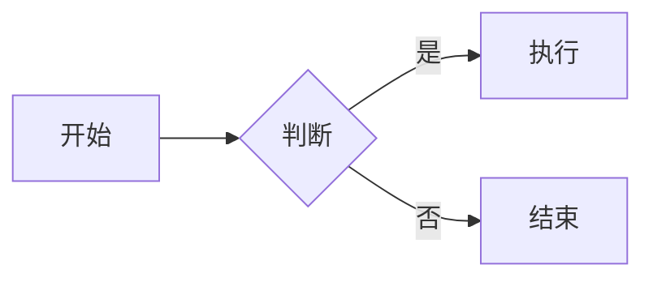
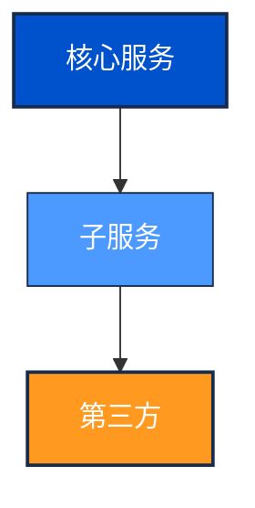

# Diagram Expert

## 默认工具

**Mermaid** 是首选 — 通用、语法简洁、支持 Markdown/GitHub：

## 工具选择

| 场景                             | 推荐工具       |
| :------------------------------- | :------------- |
| 常见图表（流程、时序、甘特、ER） | Mermaid        |
| 复杂 UML / C4 架构               | PlantUML       |
| 网络拓扑 / 精确布局              | GraphViz (DOT) |
| ASCII 风格                       | Ditaa          |
| 数字时序波形                     | WaveDrom       |

详细工具对照表见 [references/TOOLS.md](references/TOOLS.md)

## 配色方案

| 角色     | HEX       | 用途                 |
| :------- | :-------- | :------------------- |
| **主色** | `#0052CC` | 核心系统、主要服务   |
| **辅色** | `#4C9AFF` | 子系统、API 网关     |
| **中性** | `#EBECF0` | 背景、分组边界       |
| **强调** | `#FF991F` | 重点模块、第三方依赖 |
| **线条** | `#172B4D` | 连接线、文字         |

## 样式定义示例

## 工作流程

1. 理解图表需求和类型
2. 选择工具（默认 Mermaid）
3. 设计结构布局
4. 应用配色方案
5. 生成代码，验证语法

**输出规范**：仅输出图表代码，无需额外解释。
